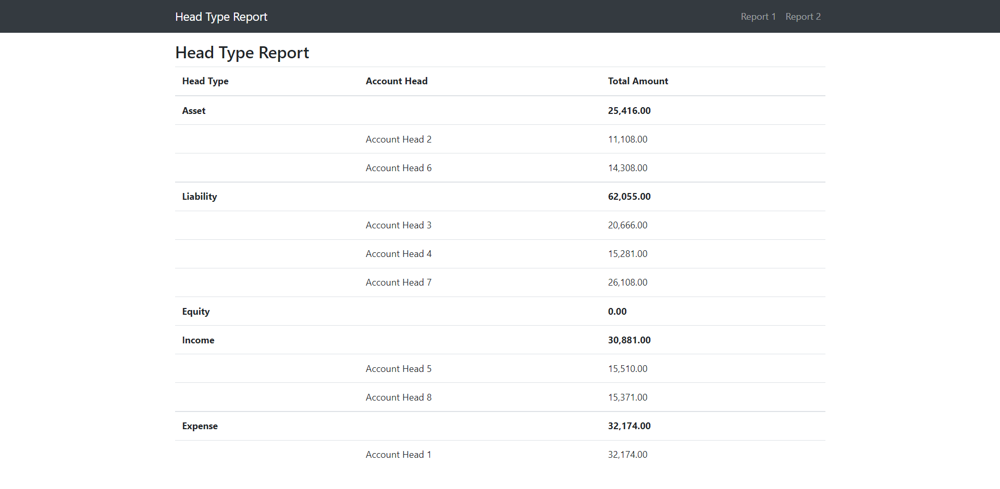
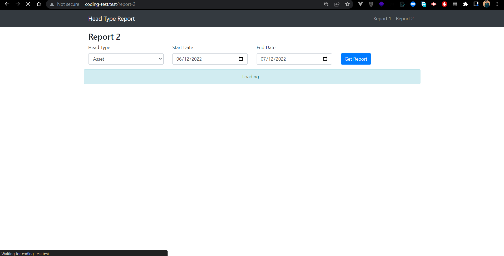
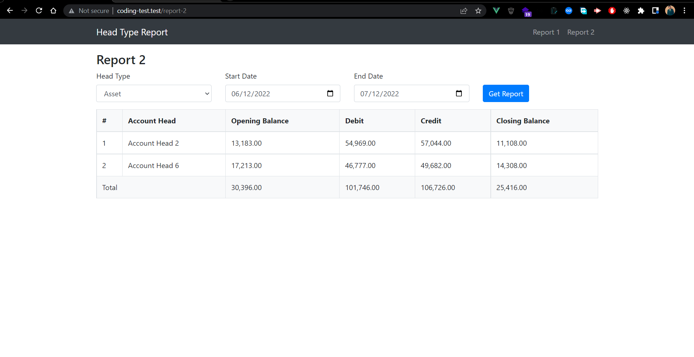
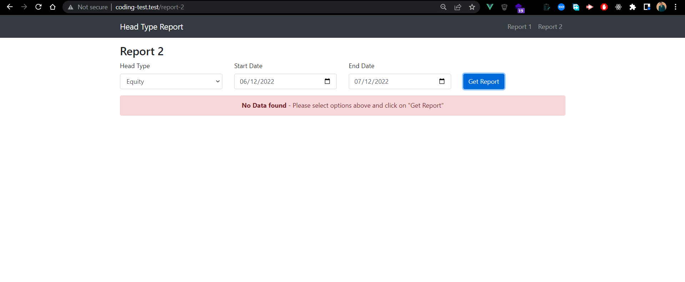

## Coding Test

Laravel9.1 & vue3 project

    Requirements:
    1. php ^8.0.2
    2. composer
    3. mysql
    4. node ^14.16.1   

## Installation Steps
```
1. Clone the repository
2. Run `composer install`
3. copy .env.example to .env
4. Run `php artisan key:generate`
5. Create a database
6. Update .env file with database credentials
7. Run `php artisan migrate`
8. Run `php artisan db:seed`
9. Run `npm install`
10. Run `npm run dev`
```
## Screenshots
### 1. Report 1

### 2. Report during loading data

### 3. Report 2 with results

### 4. Report 2 with no result


Developed By: [SAN Ratul](https://www.aboutratul.com)
